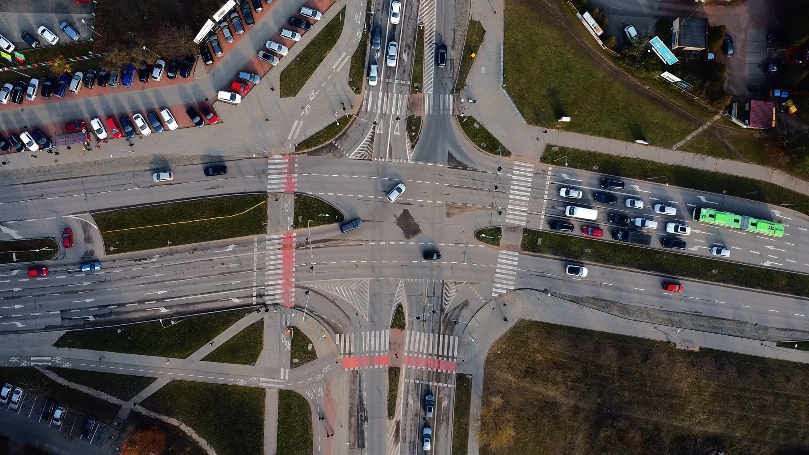

# Description of `detect.py` and `main.py`

## 🧠 `detect.py`

The `detect.py` script implements a full video analysis pipeline with:

- **Custom SAHI-style detection**
- **Motion-aware adaptive slicing**
- **Object tracking (BYTETracker)**
- **Heatmap and spotlight visualizations**

### Key Components:

- **YOLOv8 + Custom Slicing**:
  - The `CustomSAHI` class performs manual slicing and processes only active regions using a motion detector.
  - Cached detections are used for static areas to boost efficiency.

- **MotionDetector**:
  - Detects motion in grayscale frame slices.
  - Maintains recent motion history to determine detection necessity.

- **BYTETracker**:
  - Tracks objects between frames using YOLO detections.
  - Optimized for real-world traffic scenes.

- **Visualization**:
  - `draw_tracks`: draws bounding boxes and track IDs.
  - `update_heatmap`: builds a cumulative heatmap of object presence.
  - `spotlight_frame`: dims the background while highlighting selected track IDs.

- **Output**:
  - `test_4_tracked.mp4`: video with object tracking.
  - `test_4_heatmap.mp4`: heatmap overlay.
  - `test_4_highlight.mp4`: spotlighted IDs.

---

## 🧪 `main.py`

The `main.py` script offers a simpler, modular version of the pipeline using:

- **The official SAHI library**
- **Standard sliced detection**
- **BYTETracker**
- **Same visual output structure**

### Key Components:

- **SAHI Integration**:
  - Uses `get_sliced_prediction` with `AutoDetectionModel`.
  - Simple, reliable, and readable.

- **Detection Filtering**:
  - `filter_detections_with_nms`: applies class-wise NMS and filters overlapping car/truck detections.

- **Tracking and Visualization**:
  - BYTETracker for object tracking.
  - Same visualization tools as in `detect.py`.

- **Output**:
  - Three output videos: tracked, heatmap, and spotlighted.

---

## 🎯 Model Training

The YOLOv8 model used in both scripts was **trained on a custom dataset of 2,000 labeled images**, focused on traffic scenes with cars and trucks.

You may include training details, metrics (e.g. mAP, precision), or a sample dataset structure here.

---

## 📸 Screenshots

Below are visual examples of the system output. All images are stored in the `imgs/` folder.

### Raw

### 🔹 Tracked Output

### 🔸 Heatmap Overlay

### Raw

### 🔹 Tracked Output

### 🔸 Heatmap Overlay

### Raw

### 🔹 Tracked Output

### 🔸 Heatmap Overlay

---

## 🔍 Comparison

| Component                   | `detect.py`                           | `main.py`                          |
|----------------------------|----------------------------------------|------------------------------------|
| Detector                   | Custom slicing + motion-aware          | SAHI `get_sliced_prediction`       |
| Motion Awareness           | ✅ (`MotionDetector`)                  | ❌                                 |
| Slice Caching              | ✅                                      | ❌                                 |
| Tracker                    | BYTETracker                            | BYTETracker                        |
| Heatmap / Spotlight        | ✅                                      | ✅                                 |
| Resource Optimization      | ✅ adaptive detection                  | ❌                                 |
| Code Complexity            | Higher, more control                   | Cleaner, simpler integration       |

---

Both scripts are tailored for video analysis of traffic environments, offering detection, tracking, and motion visualization for surveillance or data collection purposes.
